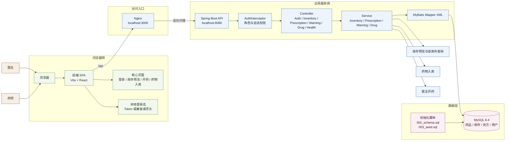

# 系统架构图（Mermaid）

以下架构图对应当前项目的最小演示闭环，突出浏览器、前端、反向代理、后端、认证、业务服务、数据访问与 MySQL 初始化关系。

## 说明

- 当前主演示链路为：登录 -> 库存预览 -> 药物入库 -> 返回库存确认 -> 医生开药。
- 药师只使用库存预览与药物入库；开药能力由后端角色校验与前端入口控制共同约束。
- 部署时浏览器统一访问 `localhost:3000`，由 Nginx 代理前端静态资源与 `/api` 请求。
- 前端优先使用 `Authorization: Bearer <token>`，同时兼容旧的用户信息请求头。
